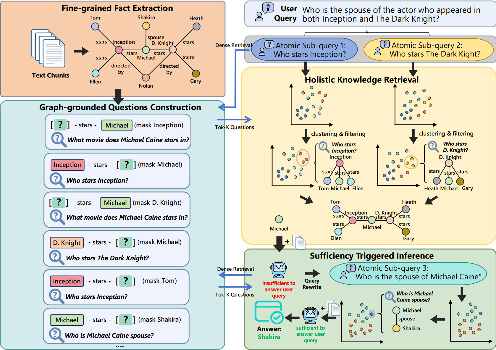

<div align= "center">
    <h1> Towards Holistic Knowledge Retrieval for Augmented Generation: Integrating Graph-Grounded and Query-Aligned Knowledge </h1>
</div>

## Overview



## Abstract

Retrieval-Augmented Generation (RAG) enables Large Language Models (LLMs) to access external knowledge during generation, improving factual reliability without parameter retraining. However, existing methods still struggle to retrieve evidence that is both relevant and complete. Standard RAG may miss semantic associations among related chunks. Graph-based RAG addresses this issue by modeling entity relations, but it is often query-agnostic. Question-format RAG further improves query matching by converting facts into Question-Answer (QA) pairs, but it cannot guarantee semantic association and introduces knowledge fragmentation. To address these issues, we propose HolisticRAG, a framework integrating graph‑grounded and query-aligned knowledge for holistic knowledge RAG. In the offline stage, HolisticRAG constructs a knowledge representation to preserve semantic associations while reducing query-agnostic retrieval. In the online stage, it applies holistic knowledge clustering to merge all fragmented evidence and adaptively retrieve sufficient supporting facts. Experiments demonstrate the effiectiveness of HolisticRAG.

## Installation

We recommend using Conda to manage the environment. All experiments are conducted with Python 3.10.

```sh
conda create -n HolisticRAG python=3.10
conda activate HolisticRAG
pip install -r requirements.txt
```

## Offline Stage

The offline stage constructs a knowledge representation that preserves semantic associations while reducing query‑agnostic retrieval. It consists of three sequential steps.

### 1. Fine-grained Fact Extraction

We first extract fine‑grained atomic facts from each document in the benchmark. Each fact is a short, self‑contained textual statement.

```sh
python fact_extraction.py --benchmark hotpotqa --model Qwen/Qwen2.5-32B-Instruct
```

### 2. Graph-grounded Questions Construction

Each atomic fact is converted into a question‑answer (QA) pair by leveraging the extracted knowledge graph. This step aligns facts with possible user queries.

```sh
python questions_construction.py --benchmark hotpotqa --embedding-model nvidia/NV-Embed-v2 --model Qwen/Qwen2.5-32B-Instruct
```

### 3. Chunk Memory

All constructed QA pairs are indexed into a dense vector store (Chunk Memory) to support efficient online retrieval.

```sh
python chunk_memory.py --benchmark hotpotqa --embedding-model nvidia/NV-Embed-v2
```

## Online Stage

Given a user query, the online stage retrieves holistic knowledge by iteratively clustering and fetching complementary evidence.

## 1. Seed Query Memory

The query is first transformed into a seed QA pair that serves as the initial retrieval anchor.

```sh
python seed_query_memory.py --benchmark hotpotqa --embedding-model nvidia/NV-Embed-v2
```

## 2. Inference (Holistic Iterative Retrieval)

The main inference loop performs holistic knowledge clustering and adaptive retrieval. It repeats until no new complementary facts are found or a maximum iteration count is reached.

```sh
python HolisticRAG.py --benchmark hotpotqa --embedding-model nvidia/NV-Embed-v2 --model Qwen/Qwen2.5-32B-Instruct --max-iter 5 --repeat-sim-threshold 0.9
```
- `--max-iter`: maximum number of iterative retrieval rounds.
- `--repeat-sim-threshold`: cosine similarity threshold to filter duplicate or overly similar retrieved facts.

The final answer is generated based on the aggregated holistic knowledge.
